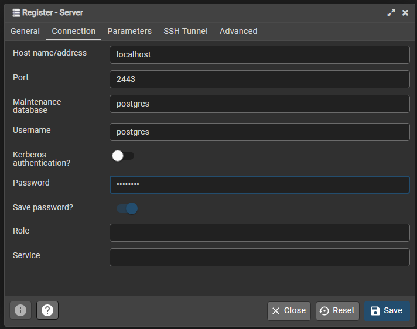

# Logitar.EventSourcing.PostgreSQL.IntegrationTests

This project provider integration tests for the Logitar.EventSourcing.PostgreSQL project. In order
to run the integration tests, you must have a running PostgreSQL database. The easiest way to do so
is by using Docker and running the following command, using the default values. The connection
string is already configured in the `appsettings.json` file.

`docker run --name Logitar.EventSourcing_postgres -e POSTGRES_PASSWORD=cptBg3hZ9qC6a5Vb -p 5435:5432 -d postgres`

You must create a database in order to run the integration tests. You may do so be downloading and
installing **pgAdmin**. Register a new server by right-clicking the `Servers` object in the left
pane, then click `Register`, and then `Server...`. Give it a name or `Logitar.EventSourcing_postgres`,
then fill the fields in the `Connection` tab, as shown in the image below, and click `Save`.

You may then expand the newly created object, then expand the `Databases` object, and right-click
the `Databases` object. Click `Create` then `Database...`. Specify the database name
`EventSourcing_SqlTests`, leaving the default values for the other fields, then click `Save`. You
may now run the integration tests.
